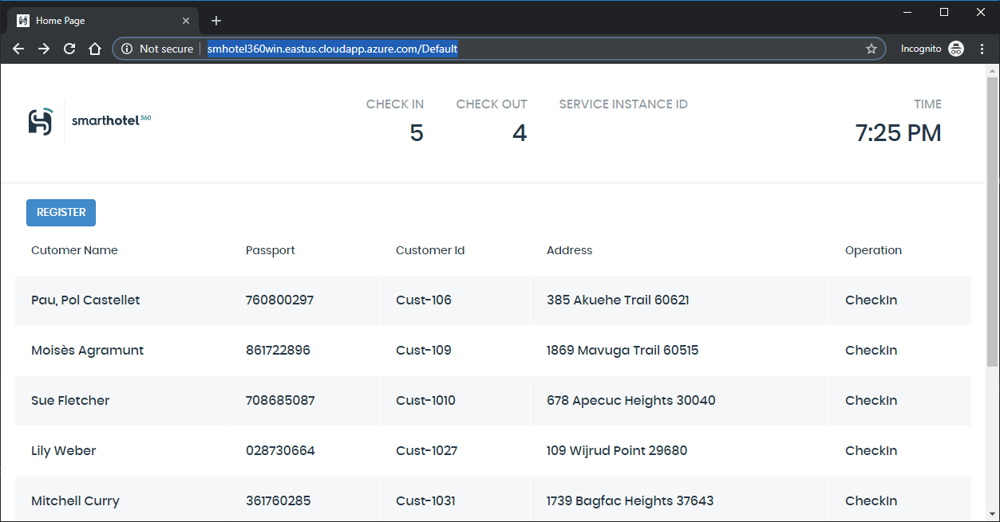

# SmartHotel 360 on Aks (with windows Containers)

This tutorial is a starting point for deploy the SmartHotel 360 Registration in an AKS with Windows nodes.



## Building the AKS

First step is configure and enable the AKS Cluster ready for windows, for doing this, you have to follow this steps:
### Install aks-preview CLI extension

The CLI commands to create and manage multiple node pools are available in the aks-preview CLI extension. Install the aks-preview Azure CLI extension using the az extension add command, as shown in the following example:

```az extension add --name aks-preview```
 
If you've previously installed the aks-preview extension, install any available updates using the az extension update ```--name aks-preview``` command.

### Register Windows preview feature
To create an AKS cluster that can use multiple node pools and run Windows Server containers, first enable the WindowsPreview feature flags on your subscription. The WindowsPreview feature also uses multi-node pool clusters and virtual machine scale set to manage the deployment and configuration of the Kubernetes nodes. Register the WindowsPreview feature flag using the az feature register command as shown in the following example:

```az feature register --name WindowsPreview --namespace Microsoft.ContainerService ```
 
> Any AKS cluster you create after you've successfully registered the WindowsPreview feature flag use this preview cluster experience. To continue to create regular, fully-supported clusters, don't enable preview features on production subscriptions. Use a separate test or development Azure subscription for testing preview features.

It takes a few minutes for the status to show Registered. You can check on the registration status using the az feature list command:

```az feature list -o table --query "[?contains(name, 'Microsoft.ContainerService/WindowsPreview')].{Name:name,State:properties.state}"```

When ready, refresh the registration of the Microsoft.ContainerService resource provider using the az provider register command:

```az provider register --namespace Microsoft.ContainerService``` 
> _Limitations_
The following limitations apply when you create and manage AKS clusters that support multiple node pools:
>Multiple node pools are available for clusters created after you've successfully registered the WindowsPreview. Multiple node pools are also available if you register the MultiAgentpoolPreview and VMSSPreview features for your subscription. You can't add or manage node pools with an existing AKS cluster created before these features were successfully registered.
You can't delete the first node pool.
While this feature is in preview, the following additional limitations apply:
> - The AKS cluster can have a maximum of eight node pools.
> - The AKS cluster can have a maximum of 400 nodes across those eight node pools.
> - The Windows Server node pool name has a limit of 6 characters.

### Create a resource group

An Azure resource group is a logical group in which Azure resources are deployed and managed. When you create a resource group, you are asked to specify a location. This location is where resource group metadata is stored, it is also where your resources run in Azure if you don't specify another region during resource creation. Create a resource group using the az group create command.

The following example creates a resource group named myResourceGroup in the eastus location.

```az group create --name myResourceGroup --location eastus`` 

The following example output shows the resource group created successfully:

```
{
  "id": "/subscriptions/<guid>/resourceGroups/myResourceGroup",
  "location": "eastus",
  "managedBy": null,
  "name": "myResourceGroup",
  "properties": {
    "provisioningState": "Succeeded"
  },
  "tags": null,
  "type": null
}
```

### Create AKS cluster
In order to run an AKS cluster that supports node pools for Windows Server containers, your cluster needs to use a network policy that uses Azure CNI (advanced) network plugin. For more detailed information to help plan out the required subnet ranges and network considerations, see configure Azure CNI networking. Use the az aks create command to create an AKS cluster named myAKSCluster. This command will create the necessary network resources if they don't exist.

The cluster is configured with one node
The windows-admin-password and windows-admin-username parameters set the admin credentials for any Windows Server containers created on the cluster.
Provide your own secure PASSWORD_WIN.

```
PASSWORD_WIN="P@ssw0rd1234"

az aks create \
    --resource-group myResourceGroup \
    --name myAKSCluster \
    --node-count 1 \
    --enable-addons monitoring \
    --kubernetes-version 1.14.0 \
    --generate-ssh-keys \
    --windows-admin-password $PASSWORD_WIN \
    --windows-admin-username azureuser \
    --enable-vmss \
    --network-plugin azure
```

After a few minutes, the command completes and returns JSON-formatted information about the cluster.

### Add a Windows Server node pool
By default, an AKS cluster is created with a node pool that can run Linux containers. Use az aks nodepool add command to add an additional node pool that can run Windows Server containers.

```
az aks nodepool add \
    --resource-group myResourceGroup \
    --cluster-name myAKSCluster \
    --os-type Windows \
    --name npwin \
    --node-count 1 \
    --kubernetes-version 1.14.0
```

The above command creates a new node pool named npwin and adds it to the myAKSCluster. When creating a node pool to run Windows Server containers, the default value for node-vm-size is Standard_D2s_v3. If you choose to set the node-vm-size parameter, please check the list of restricted VM sizes. The minimum recommended size is Standard_D2s_v3. The above command also uses the default subnet in the default vnet created when running az aks create.

### Connect to the cluster
To manage a Kubernetes cluster, you use kubectl, the Kubernetes command-line client. If you use Azure Cloud Shell, kubectl is already installed. To install kubectl locally, use the az aks install-cli command:

```az aks install-cli```

To configure kubectl to connect to your Kubernetes cluster, use the az aks get-credentials command. This command downloads credentials and configures the Kubernetes CLI to use them.

```az aks get-credentials --resource-group myResourceGroup --name myAKSCluster ```

To verify the connection to your cluster, use the kubectl get command to return a list of the cluster nodes.

```kubectl get nodes```

## Setting up an AKS Cluster with Windows Machines

for installing this application you need to have helm installed on your local machine and in your kubernetes cluster. You can achieve this following these instructions:

## Download and install helm

You can download from their releases page on github or install vía chocolatey package manager:

```$ choco install kubernetes-helm```

After that you can install helm doing

```$ kubectl apply -f tiller-rbac.yaml```
```$ helm init --node-selectors "beta.kubernetes.io/os"="linux" --service-account tiller ```

Now it's time to setup the ingress controller. This controller has the responsability of route the traffic to the appropiate pod, you can setup this doing:

```
helm install stable/nginx-ingress \ 
    --name smgateway \
    --namespace kube-system \
    --set controller.replicaCount=2 
    --set controller.nodeSelector."beta\.kubernetes\.io/os"=linux  \
    --set defaultBackend.nodeSelector."beta\.kubernetes\.io/os"=linux
```
    

Once time you have completed this stage, you can install the application executing the powershell script:

```> deploy.ps1 -dnsname yourawesomednsname```

>Note there is a parameter call ```dnsname```, this is the dns name of your aks cluster. With this script it associates the dns name to the nginx/ingress controller, if you dont pass a value to this parameter, or you don't setup, it will try to register the dnsname _smhotel360win_


