# SmartHotel360

We are happy to announce the release of SmartHotel360. This release intends to share a simplified version of SmartHotel360 reference sample apps used at Connect(); 2017 Keynotes. If you missed it, you can watch <a href="https://channel9.msdn.com/Events/Connect/2017/K100">Scott Guthrie’s Keynote: Journey to the Intelligent Cloud in Channel 9</a>.

We updated the code for this repository to support Scott Hanselman's General Session from Ignite 2018, [An end-to-end tour of the Microsoft developer platform](https://myignite.techcommunity.microsoft.com/sessions/66696#ignite-html-anchor). 

# SmartHotel360 Repos
For this reference app scenario, we built several consumer and line-of-business apps and an Azure backend. You can find all SmartHotel360 repos in the following locations:

* [SmartHotel360 ](https://github.com/Microsoft/SmartHotel360)
* [IoT](https://github.com/Microsoft/SmartHotel360-IoT)
* [Backend](https://github.com/Microsoft/SmartHotel360-Backend)
* [Website](https://github.com/Microsoft/SmartHotel360-Website)
* [Mobile](https://github.com/Microsoft/SmartHotel360-Mobile)
* [Sentiment Analysis](https://github.com/Microsoft/SmartHotel360-SentimentAnalysis)
* [Registration](https://github.com/Microsoft/SmartHotel360-Registration)

# SmartHotel360 - Registration

The application we are using in this sample is a hotel front-desk registration application. It's basic functionality is to check guest in and out.

<p align="center">
        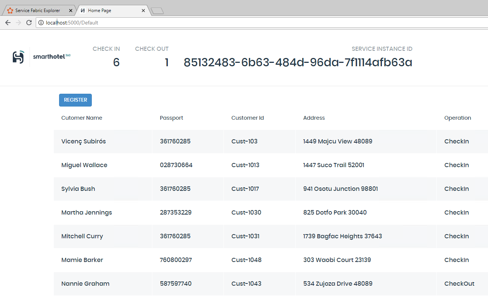
    </p>

# Getting Started 

To modernize the application, it is followed a lift and shift approach to move it to Azure. To do so, we first need to containerize the application and later host it in Azure Service Fabric.

The application is the existing WebForms, WCF and Azure SQL Database pieces, as depicted below. This is a very traditional three-tire application, using Entity Framework to integrate with the data in the Azure SQL database, exposing it through a WCF service, which the WebForms application then interacts with.

   <p align="center">
        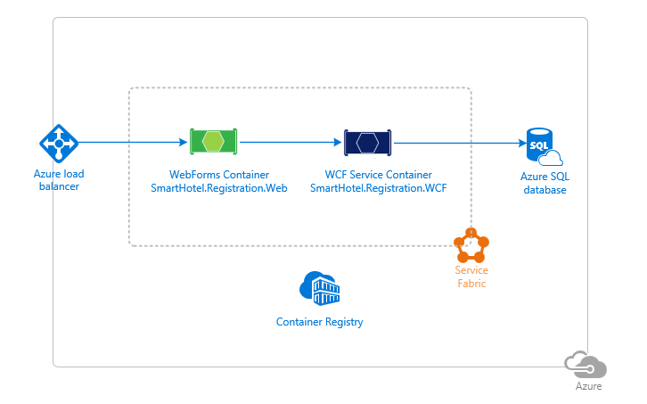
    </p>

The final step of the modernization is to add a Service Fabric Stateful service to store registration information that can later be retrieved by the WebForms app to show different registration KPIs. Data is stored using SF Reliable Collections and distributed in different service partitions.

  <p align="center">
        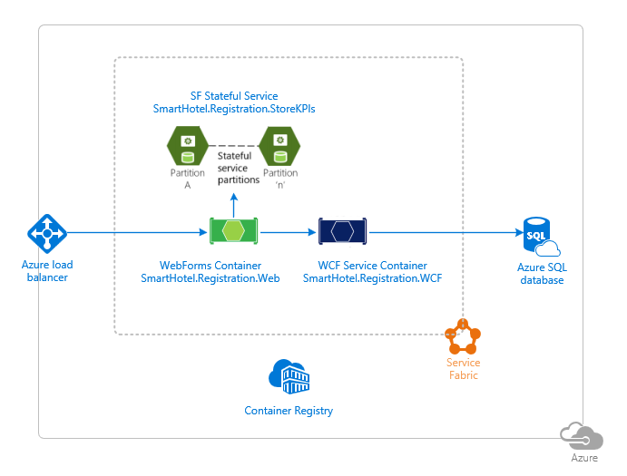
    </p>

## Key Takeaways

The key takeaways of this demo are:
* Lift and shift Full Framework applications to Azure.
* Create Service Fabric Stateful Reliable Services that interact with Guest Full Framework apps.
* Debug apps and services locally with Service Fabric SDK.

## Demo Scenario

Deploy lift and shift full framework apps locally
* Illustrates how easy it is to deploy and debug apps in Service Fabric locally

Deploy lift and shift full framework apps to Azure
* Instructs the steps to deploy apps to Azure Service Fabric

Deploy stateful Reliable Service locally
* Presents an scenario where a stateful service is deployed along with the lift and shift full framework apps and how easy is to debug these services.

Deploy stateful Reliable Service to Azure
* Shows the steps to deploy the stateful Reliable Service scenario to Azure Service Fabric.

# Setup

### Local Setup
For the demo, a sandboxed Windows 10 virtual machine has been created in Azure with all the tools and SDKs preinstalled. Find RDP connection file at: **.\deploy\vm\SFDemo.rdp**
Optionally, in case of setting up another environment these are the requirements: 
*	Windows 10
*	Visual Studio 2017 Community Edition - Version 15.5 - https://www.visualstudio.com/ 
*	You need to have the Azure and .NET workload enabled
*	Docker CE - https://store.docker.com/editions/community/docker-ce-desktop-windows
*	Service Fabric SDK - 3.0 or never - https://docs.microsoft.com/en-us/azure/service-fabric/service-fabric-get-started
*	Service Fabric Preview Tooling for 2017 - https://blogs.msdn.microsoft.com/azureservicefabric/2018/02/06/new-preview-tooling-for-visual-studio-2017/
Additionally, due to a Windows 10 limitation with dns and containers in VMs, UDP offload checksum in the VM needs to be disabled. Find Instructions at: **.\docs\DNS.in.VMs.pdf**

### Azure Setup

# Deploy to Azure

Execute the powershell script to create all the infrastructure necessary to deploy the applications to Service Fabric in Azure. The script is located at: **.\deploy\gen-sf-resources.ps1**
Replace the values and execute the following command in a Powershell console:
```
.\gen-sf-resources.ps1 -subscriptionId <subscriptionId> -resourceGroupName <resource group name> -vaultName <keyvault name> -vaultPwd <keyvault password> -clustername <cluster name> -clusterAdminUser <cluster admin name> -clusterAdminPwd <cluster admin password> -dbAdminUser <database username> -dbAdminPwd <database password> -location <resource location> -certPwd <certificate password>
```
Once the deployment is finished, the resources shown below should appear under your resource group in Azure Portal:

<p align="center">
    
</p>

## Exercise 1: Deploy lift and shift full framework apps locally

1.	Open visual studio 2017 as Administrator
2.	Open the SmartHotel.Registration solution.

    <p align="center">
        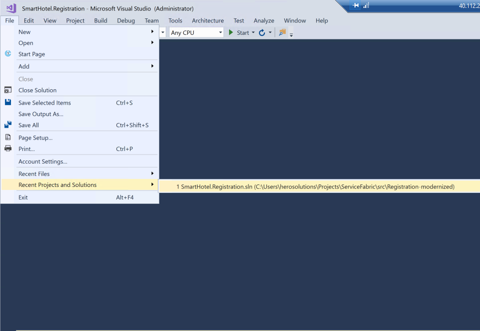
    </p>
    > In the solution explorer 4 projects are shown. 
    The ApplicationModern  which contains all SF manifests.
    The Registration.Wcf contains a containerized WCF service.
    The Registration.Web contains a containerized Web Forms app.
    The Registration.StoreKPIs contains a .Net Core stateful Reliable Service for storing registration KPIs in Reliable Collections. 

3.	Open the Local.1Node and Local.5Node xml file and set the DefaultConnection parameter with the database UserId and Password  previously used in the setup chapter

    <p align="center">
        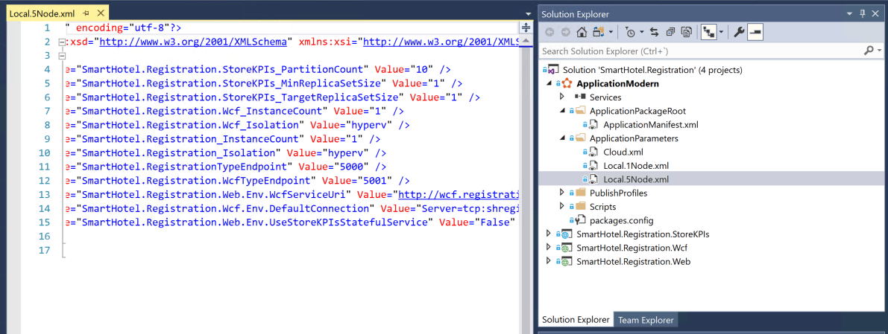
    </p>
    > These xml files configure the Service fabric settings when deploying to SF locally.

4.	Click Start button

    <p align="center">
        
    </p>
    > With F5 experience, Visual Studio will generate the docker images for each service and deploy the app to the local SF cluster.

5.	Connect to Service Fabric Dashboard: http://localhost:19080/Explorer

    <p align="center">
        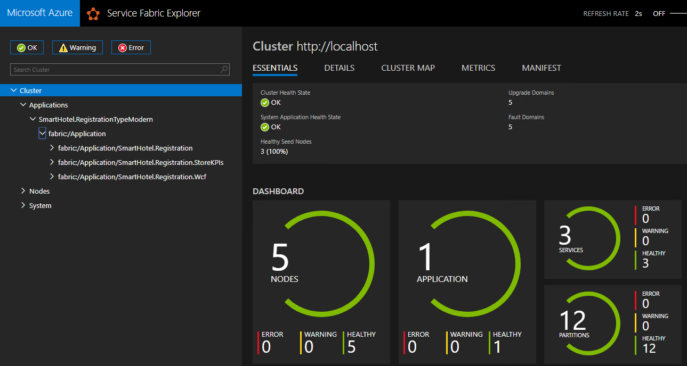
    </p>
    > Verify that the application and 3 services have been deployed. 
    Verify that the nodes, application and services are in healthy state in the Service Fabric dashboard (This might take a while).

6.	Open the Default.aspx.cs file in the Web.Registration project and set a breakpoint.

7.	Go to the web browser and enter the url: http://localhost:5000

    <p align="center">
        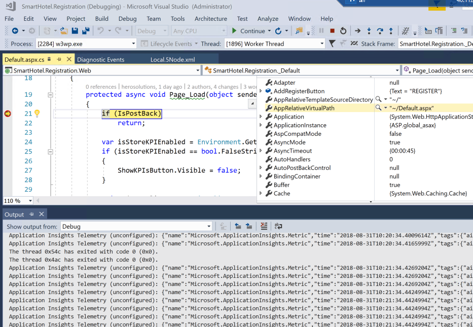
    </p>

    <p align="center">
        
    </p>
    > Check that the Registration web app is shown in the browser and the breakpoint is hit in Visual Studio ready to debug.
    The Web app shows a list of customer registrations. If so, it means that all services are up and running and the Web App is able to communicate with WCF service in SF cluster.


## Exercise 2: Deploy lift and shift full framework apps to Azure

1.	Open the Cloud xml file and set the DefaultConnection parameter with the database UserId and Password  previously used in the setup chapter.

2.	Set the Registration_InstanceCount parameter to 3.

    <p align="center">
        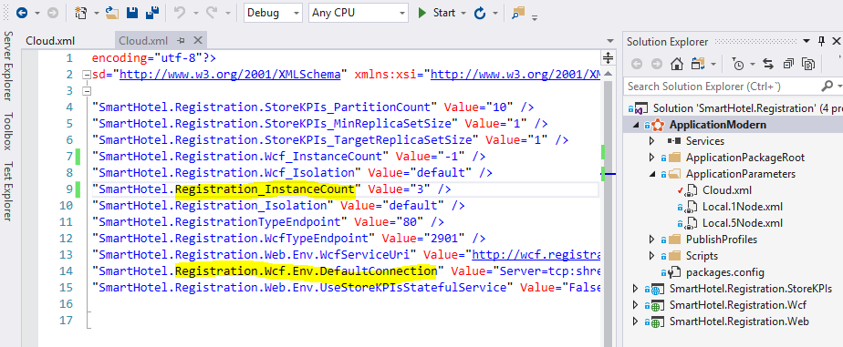
    </p>
    > This xml file configure the Service fabric settings when deploying to SF in Azure.
    By setting up the InstanceCount parameters we are telling SF to scale the app to multiple instances during deployment.

3.	Right click on the ApplicationModern SF project and select Publish option.

    <p align="center">
        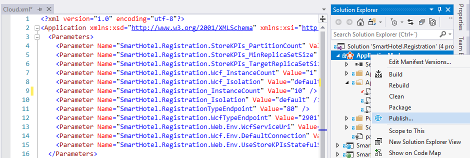
    </p>

4.	Select the connection endpoint pointing to the Service Fabric you previously created in the setup chapter.

5.	Select the Azure Container Registry you previously created in the setup chapter. 

    <p align="center">
        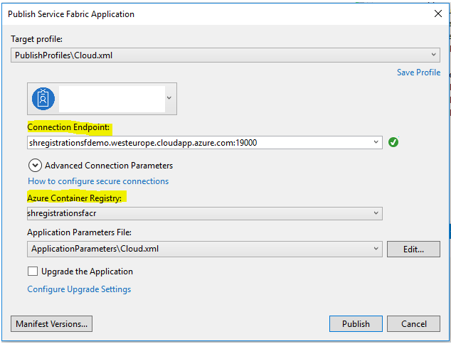
    </p>
    > When publishing, Visual Studio builds de docker images for each service and push them to the Container Registry. After that, it deploys the SF app to the cluster in Azure.

6.	Go to Azure Portal https://portal.azure.com

7.	Login and go to the resource group you used in the setup chapter.

8.	Click the Service Fabric Resource and select the Explorer link.

    <p align="center">
        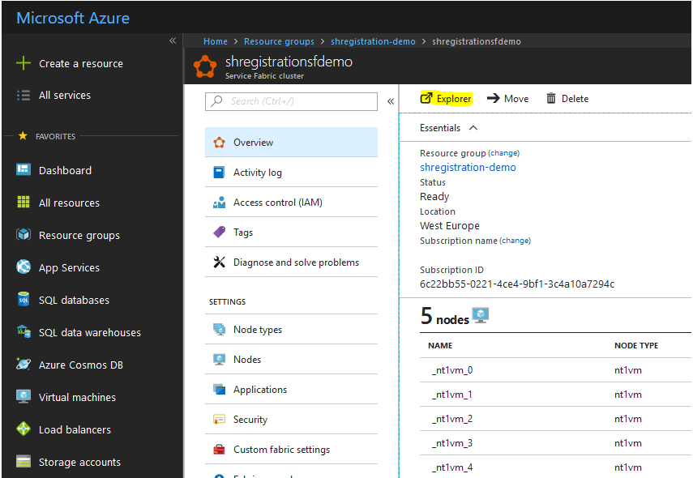
    </p>

9.	When the browser warns about it is an insecure site. Continue and select the certificate when the browser asks to.

    <p align="center">
        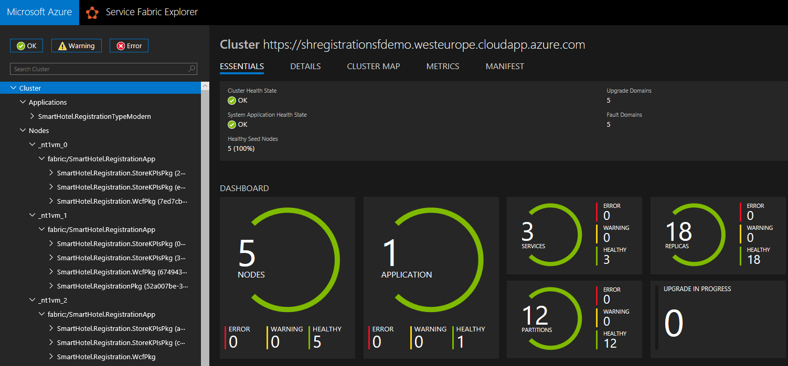
    </p>

10.	Go to the dashboard, select the SmartHotel.Registration Service under Applications.

    <p align="center">
        
    </p>
    > Verify that the application and 3 services have been deployed. Check that the nodes, application and services are in healthy state in the Service Fabric dashboard (This might take a while) and SmartHotel.Registration Service has 3 instances created


11.	Go to the browser and enter your cluster dnsname

12.	Refresh the browser multiple times

    <p align="center">
        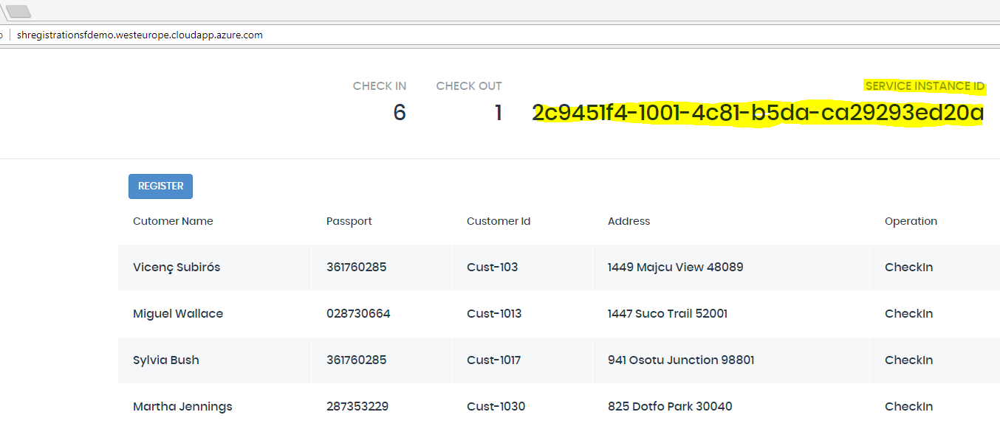
    </p>
    > Check that the Service Instance Id is changing depending on the instance that is processing the request.

13.	Go to the dashboard, select the SmartHotel.Registration Service under Applications and click the right button.

14.	Select Scale Service option and set a -1 value

     <p align="center">
        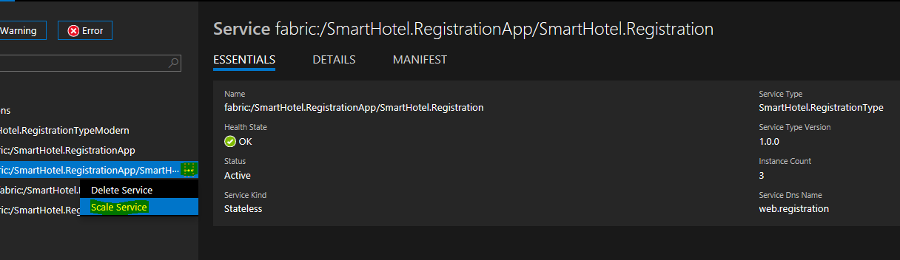
    </p>
     > Change the number of instances from the dashboard. After a while, the service instances should be rescaled.


## Exercise 3: Deploy stateful Reliable Service locally

1.	Open visual studio 2017 as Administrator
2.	Open the SmartHotel.Registration solution.

    <p align="center">
        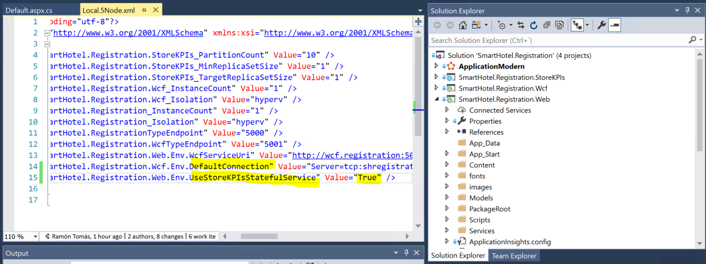
    </p>

    > In the solution explorer 4 projects are shown. 
    The ApplicationModern  which contains all SF manifests.
    The Registration.Wcf contains a containerized WCF service.
    The Registration.Web contains a containerized Web Forms app.
    The Registration.StoreKPIs contains a .Net Core stateful Reliable Service for storing registration KPIs in Reliable Collections. 

3.	Open the Local.1Node and Local.5Node xml file 
    > These xml files configure the Service fabric settings when deploying to SF locally.

4.	Set the **DefaultConnection** parameter with the database **UserId** and **Password**  previously used in the setup chapter.

5.	Set the **UseStoreKPIsStatefulService** parameter to **True**

6.	Click Start button
     <p align="center">
        
    </p>
     > With F5 experience, Visual Studio will generate the docker images for each service and deploy the app to the local SF cluster.

10.	Connect to Service Fabric Dashboard: http://localhost:19080/Explorer
    <p align="center">
        
    </p>
    > Verify that the application and 3 services have been deployed. Verify that the nodes, application and services are in healthy state in the Service Fabric dashboard (This might take a while).

11.	Go to the dashboard, select the SmartHotel.Registration.StoreKPIs Service under.

    <p align="center">
        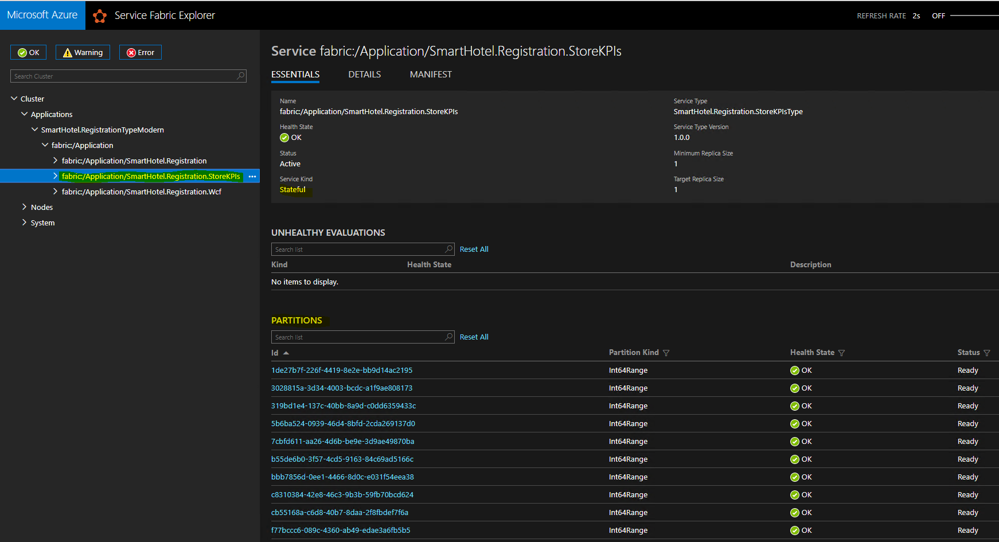
    </p>
    > Verify that the stateful service and the 10 partitions are in Healthy state.

12.	Open the ValuesController.cs file in the Registration.StoreKPIs project and set a breakpoint to the Get/Id endpoint.

    <p align="center">
        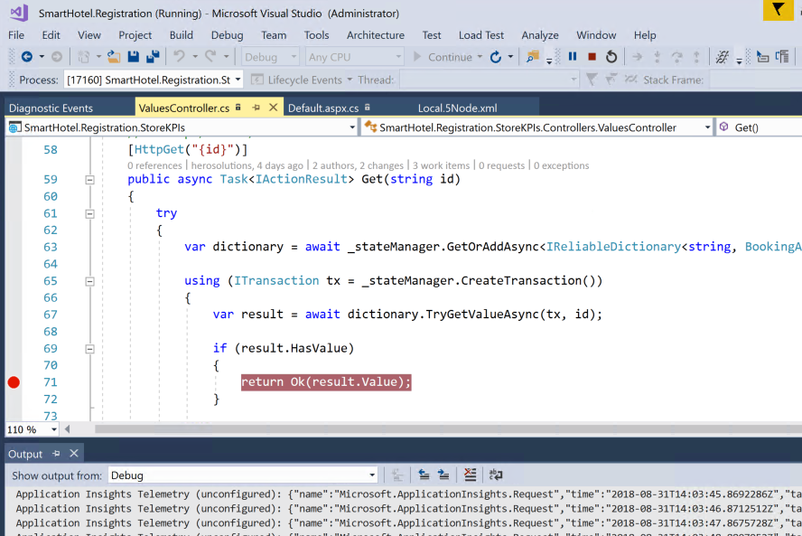
    </p>

13.	Go to the web browser and enter the url: http://localhost:5000

14.	Click Display KPI button

    <p align="center">
        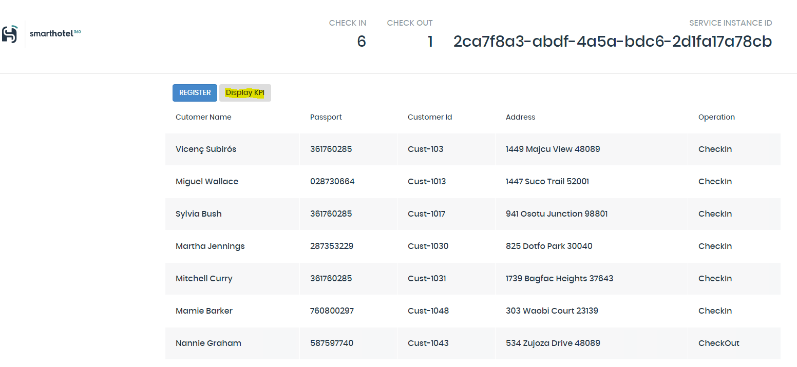
    </p>
    > The Display KPI button should appear. When clicking the button, it is redirected to the KPIs page where it is shown a chart with registration KPIs. 

    <p align="center">
        
    </p>

15.	Select a user from the Dropdownlist

    <p align="center">
        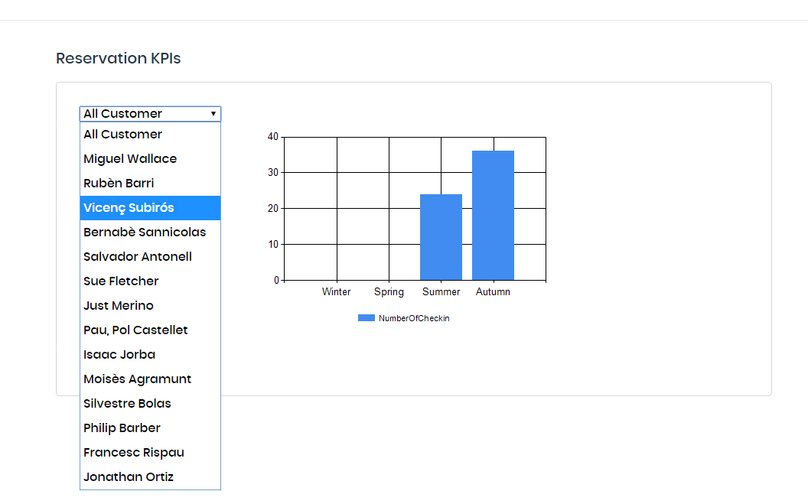
    </p>
    > The breakpoint in the Registration.StoreKPIs service should be hit since the PKIs page retrieves the data from that stateful service. You can debug the service and check that the Reliable Collections where data is stored contains the registration KPIs for that specific user.

    <p align="center">
        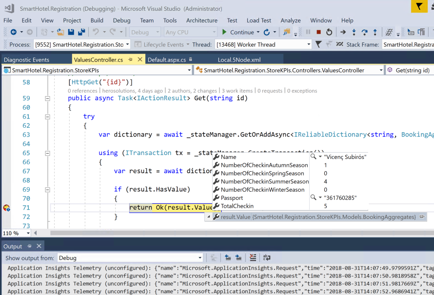
    </p>


## Exercise 4: Deploy stateful Reliable Service to Azure

1.	Open the Cloud xml file and set the DefaultConnection parameter with the database UserId and Password  previously used in the setup chapter.

2.	Set the UseStoreKPIsStatefulService parameter to True

    <p align="center">
        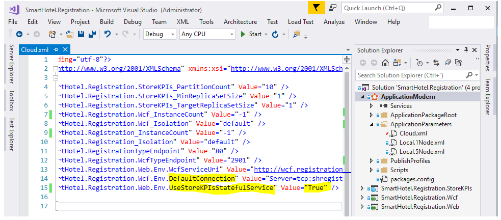
    </p>
    > This xml file configure the Service fabric settings when deploying to SF in Azure.

3.	Right click on the ApplicationModern SF project and select Publish option.

    <p align="center">
        
    </p>

4.	Select the connection endpoint pointing to the Service Fabric you previously created in the setup chapter.

5.	Select the Azure Container Registry you previously created in the setup chapter. 

    <p align="center">
        
    </p>
    > When publishing, Visual Studio builds de docker images for each service and push them to the Container Registry. After that, it deploys the SF app to the cluster in Azure.

6.	Go to Azure Portal https://portal.azure.com

7.	Login and go to the resource group you used in the setup chapter.

8.	Click the Service Fabric Resource and select the Explorer link.

9.	When the browser warns about it is an insecure site. Continue and select the certificate when the browser asks to.

10.	Go to the dashboard, select the SmartHotel.Registration.StoreKPIs Service under Applications.

    <p align="center">
        
    </p>
    > Verify that the application and 3 services have been deployed. Check that the nodes, application and services are in healthy state in the Service Fabric dashboard and SmartHotel.Registration Service has 3 instances created (This might take a while).

    <p align="center">
        
    </p>

    <p align="center">
        
    </p>
    > Verify that the Registration.StoreKPIs  stateful service and the 10 partitions are in Healthy state.

11.	Go to the browser and enter your cluster dnsname

12.	Click Display KPI button

    <p align="center">
        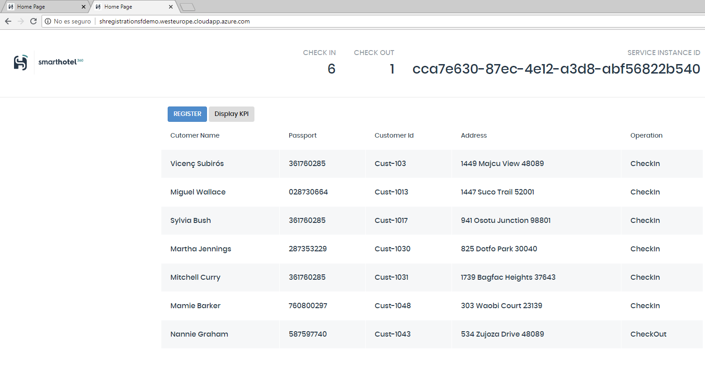
    </p>
    > The Display KPI button should appear. When clicking the button, it is redirected to the KPIs page where it is shown a chart with registration KPIs. 

    <p align="center">
        
    </p>

13.	Click Back button to return to the main page.

14.	Click Register button

15.	Register a new reservation

    <p align="center">
        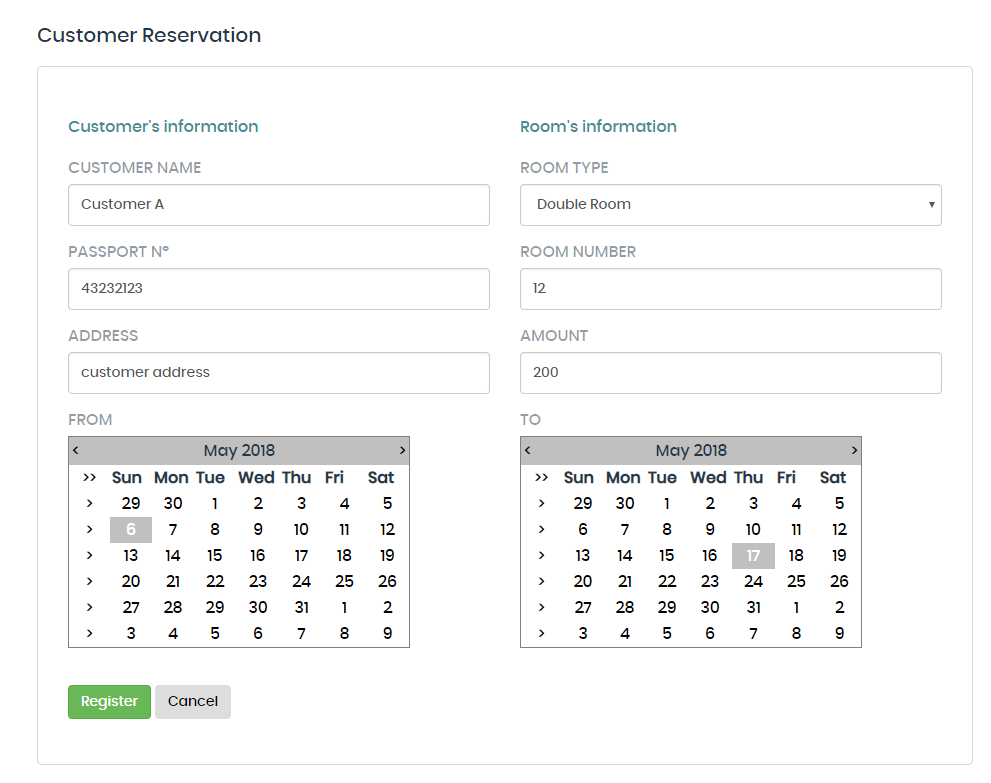
    </p>
    > Registers a new reservation and it is redirected to the main page.

16.	Click Display KPI button

    > The page shows the KPIs of all the customer registrations. This data is recollected from the stateful Register.StoreKPI service.

17.	Select the new created customer in the dropdownlist

    <p align="center">
        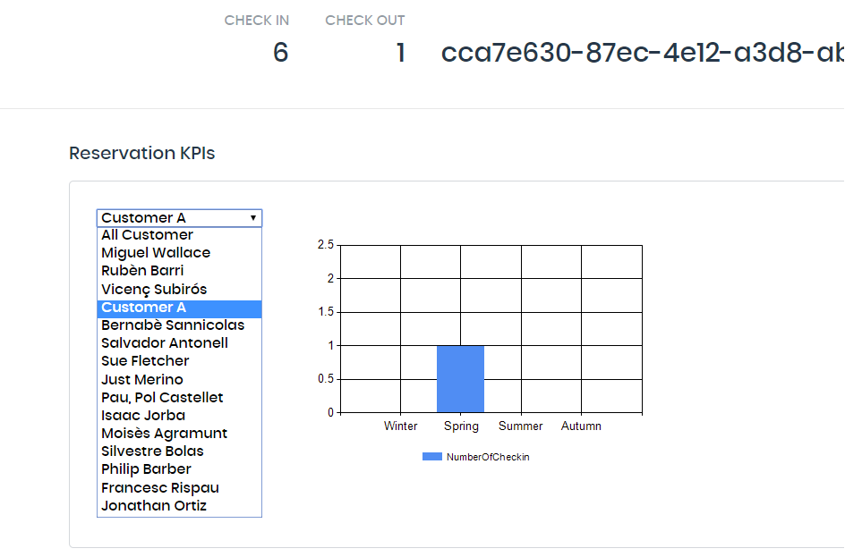
    </p>
    > The new customer should appear in the list and show its KPIs

# Summary

Service Fabric allows us to easily lift and shift Full Framework applications and bring them to Azure providing all the benefits of the cloud such as reliability and scalability. Furthermore, Service Fabric tools helps us to deploy and debug the apps and services locally. 

# Contributing

This project welcomes contributions and suggestions.  Most contributions require you to agree to a
Contributor License Agreement (CLA) declaring that you have the right to, and actually do, grant us
the rights to use your contribution. For details, visit https://cla.microsoft.com.

When you submit a pull request, a CLA-bot will automatically determine whether you need to provide
a CLA and decorate the PR appropriately (e.g., label, comment). Simply follow the instructions
provided by the bot. You will only need to do this once across all repos using our CLA.

This project has adopted the [Microsoft Open Source Code of Conduct](https://opensource.microsoft.com/codeofconduct/).
For more information see the [Code of Conduct FAQ](https://opensource.microsoft.com/codeofconduct/faq/) or
contact [opencode@microsoft.com](mailto:opencode@microsoft.com) with any additional questions or comments.