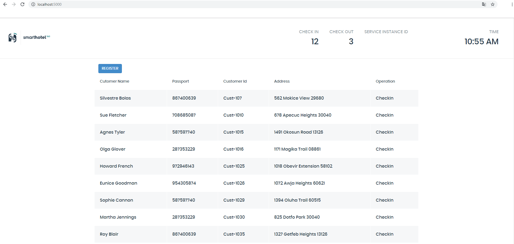
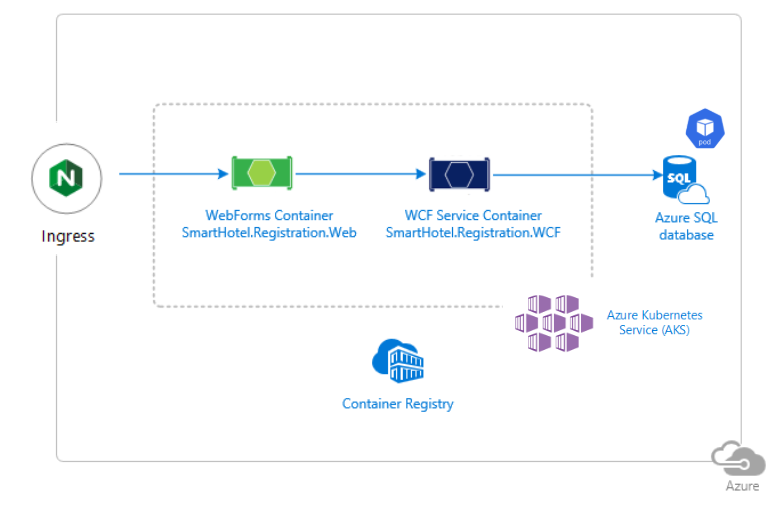
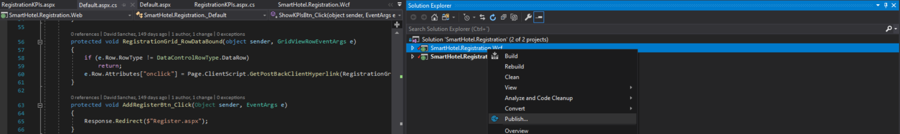
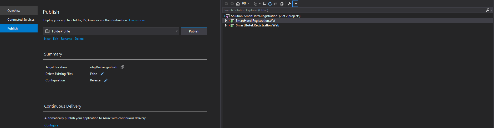
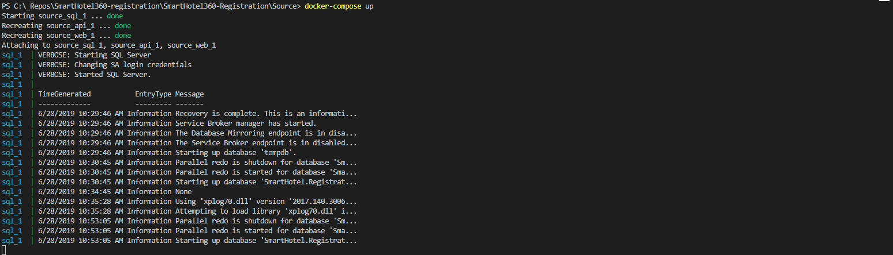

# SmartHotel360

We are happy to announce the release of SmartHotel360. This release intends to share a simplified version of SmartHotel360 reference sample apps used at Connect(); 2017 Keynotes. If you missed it, you can watch <a href="https://channel9.msdn.com/Events/Connect/2017/K100">Scott Guthrie’s Keynote: Journey to the Intelligent Cloud in Channel 9</a>.

We updated the code for this repository to support Scott Hanselman's General Session from Ignite 2018, [An end-to-end tour of the Microsoft developer platform](https://myignite.techcommunity.microsoft.com/sessions/66696#ignite-html-anchor). 

# SmartHotel360 Repos
For this reference app scenario, we built several consumer and line-of-business apps and an Azure backend. You can find all SmartHotel360 repos in the following locations:

- [SmartHotel360](https://github.com/Microsoft/SmartHotel360)
- [IoT](https://github.com/Microsoft/SmartHotel360-IoT)
- [Mixed Reality](https://github.com/Microsoft/SmartHotel360-MixedReality)
- [Backend](https://github.com/Microsoft/SmartHotel360-Backend)
- [Website](https://github.com/Microsoft/SmartHotel360-Website)
- [Mobile](https://github.com/Microsoft/SmartHotel360-Mobile)
- [Sentiment Analysis](https://github.com/Microsoft/SmartHotel360-SentimentAnalysis)
- [Registration](https://github.com/Microsoft/SmartHotel360-Registration)

# SmartHotel360 - Registration

The application we are using in this sample is a hotel front-desk registration application. It's basic functionality is to check guest in and out.



# Getting Started 

To modernize the application, it is followed a lift and shift approach to move it to Azure. To do so, we first need to containerize the application and later host it in Azure Kubernetes Service (AKS).

The application is the existing WebForms, WCF and Azure SQL Database pieces, as depicted below. This is a very traditional three-tire application, using Entity Framework to integrate with the data in the Azure SQL database, exposing it through a WCF service, which the WebForms application then interacts with.




## Key Takeaways
The key takeaways of this demo are:

Lift and shift Full Framework applications to Azure.
Deploy the SmartHotel 360 Registration in an AKS with Windows nodes
Debug apps and services locally with Docker.

## Demo Scenario

- Deploy locally with Docker
Illustrates how easy it is to deploy and debug apps with Docker.

- Deploy on AKS (with windows Containers)
Instructs the steps to deploy apps to Azure Kubernetes Service.

## Setup

You will need:

- Windows 10
- Visual Studio 2017 Version 15.5 or higher.
- You need to have the Azure and .NET workload enabled
- Docker
- Aks-preview CLI extension
- Download and install helm

## Azure Setup

Execute the powershell script to create all the infrastructure necessary to deploy the applications in Azure. The script is located at: **.\deploy\gen-sf-resources.ps1**
Replace the values and execute the following command in a Powershell console:

```
.\gen-sf-resources.ps1 -subscriptionId <subscriptionId> -resourceGroupName <resource group name> -vaultName <keyvault name> -vaultPwd <keyvault password> -clustername <cluster name> -clusterAdminUser <cluster admin name> -clusterAdminPwd <cluster admin password> -dbAdminUser <database username> -dbAdminPwd <database password> -location <resource location> -certPwd <certificate password>
```

Once the deployment is finished, the resources shown below should appear under your resource group in Azure Portal.

## Exercise 1: Deploy lift and shift locally 

1. Open Visual Studio as Administrator.

2. Open the SmartHotel.Registration solution.

3. Open and set Docker with Windows Containers.

4. Publish the two projects: SmartHotel.Registration.Wcf and SmartHotel.Registration.Web using Visual Studio. This publish will generate necessary files to run the project locally with docker. In this case we have published these projects in obj\Docker\publish in accordance with docker files project (COPY ${source:-obj/Docker/publish} .)





5. Now we are ready to run. Located where docker-compose.yml is, run docker-compose build and docker-compose up to deploy all resources needed.
If it is your first time remember that docker-compose build may take some time because is creating all images.

6. After docker-compose up finishes website will be deployed and accessible at http://localhost:5000/



The Web app shows a list of customer registrations. If so, it means that all services are up and running.


We could to debug the apps and services locally running these projects with Visual Studio.

## Exercise 2: Deploy lift and shift with Azure Kubernetes Service (AKS)

This tutorial is a starting point for deploy the SmartHotel 360 Registration in an AKS with Windows nodes.

1. Building the AKS
First step is configure and enable the AKS Cluster ready for windows, for doing this, you have to follow this steps:

### Install aks-preview CLI extension

The CLI commands to create and manage multiple node pools are available in the aks-preview CLI extension. Install the aks-preview Azure CLI extension using the az extension add command, as shown in the following example:

```az extension add --name aks-preview```

If you've previously installed the aks-preview extension, install any available updates using the az extension update ```--name aks-preview``` command.

### Register Windows preview feature
To create an AKS cluster that can use multiple node pools and run Windows Server containers, first enable the WindowsPreview feature flags on your subscription. The WindowsPreview feature also uses multi-node pool clusters and virtual machine scale set to manage the deployment and configuration of the Kubernetes nodes. Register the WindowsPreview feature flag using the az feature register command as shown in the following example:

```az feature register --name WindowsPreview --namespace Microsoft.ContainerService ```
 
> Any AKS cluster you create after you've successfully registered the WindowsPreview feature flag use this preview cluster experience. To continue to create regular, fully-supported clusters, don't enable preview features on production subscriptions. Use a separate test or development Azure subscription for testing preview features.

It takes a few minutes for the status to show Registered. You can check on the registration status using the az feature list command:

```az feature list -o table --query "[?contains(name, 'Microsoft.ContainerService/WindowsPreview')].{Name:name,State:properties.state}"```

When ready, refresh the registration of the Microsoft.ContainerService resource provider using the az provider register command:

```az provider register --namespace Microsoft.ContainerService``` 
> _Limitations_
The following limitations apply when you create and manage AKS clusters that support multiple node pools:
>Multiple node pools are available for clusters created after you've successfully registered the WindowsPreview. Multiple node pools are also available if you register the MultiAgentpoolPreview and VMSSPreview features for your subscription. You can't add or manage node pools with an existing AKS cluster created before these features were successfully registered.
You can't delete the first node pool.
While this feature is in preview, the following additional limitations apply:
> - The AKS cluster can have a maximum of eight node pools.
> - The AKS cluster can have a maximum of 400 nodes across those eight node pools.
> - The Windows Server node pool name has a limit of 6 characters.

### Create a resource group

An Azure resource group is a logical group in which Azure resources are deployed and managed. When you create a resource group, you are asked to specify a location. This location is where resource group metadata is stored, it is also where your resources run in Azure if you don't specify another region during resource creation. Create a resource group using the az group create command.

The following example creates a resource group named myResourceGroup in the eastus location.

```az group create --name myResourceGroup --location eastus`` 

The following example output shows the resource group created successfully:

```
{
  "id": "/subscriptions/<guid>/resourceGroups/myResourceGroup",
  "location": "eastus",
  "managedBy": null,
  "name": "myResourceGroup",
  "properties": {
    "provisioningState": "Succeeded"
  },
  "tags": null,
  "type": null
}
```

### Create AKS cluster
In order to run an AKS cluster that supports node pools for Windows Server containers, your cluster needs to use a network policy that uses Azure CNI (advanced) network plugin. For more detailed information to help plan out the required subnet ranges and network considerations, see configure Azure CNI networking. Use the az aks create command to create an AKS cluster named myAKSCluster. This command will create the necessary network resources if they don't exist.

The cluster is configured with one node
The windows-admin-password and windows-admin-username parameters set the admin credentials for any Windows Server containers created on the cluster.
Provide your own secure PASSWORD_WIN.

```
PASSWORD_WIN="P@ssw0rd1234"

az aks create \
    --resource-group myResourceGroup \
    --name myAKSCluster \
    --node-count 1 \
    --enable-addons monitoring \
    --kubernetes-version 1.14.0 \
    --generate-ssh-keys \
    --windows-admin-password $PASSWORD_WIN \
    --windows-admin-username azureuser \
    --enable-vmss \
    --network-plugin azure
```

After a few minutes, the command completes and returns JSON-formatted information about the cluster.

### Add a Windows Server node pool
By default, an AKS cluster is created with a node pool that can run Linux containers. Use az aks nodepool add command to add an additional node pool that can run Windows Server containers.

```
az aks nodepool add \
    --resource-group myResourceGroup \
    --cluster-name myAKSCluster \
    --os-type Windows \
    --name npwin \
    --node-count 1 \
    --kubernetes-version 1.14.0
```

The above command creates a new node pool named npwin and adds it to the myAKSCluster. When creating a node pool to run Windows Server containers, the default value for node-vm-size is Standard_D2s_v3. If you choose to set the node-vm-size parameter, please check the list of restricted VM sizes. The minimum recommended size is Standard_D2s_v3. The above command also uses the default subnet in the default vnet created when running az aks create.

### Connect to the cluster
To manage a Kubernetes cluster, you use kubectl, the Kubernetes command-line client. If you use Azure Cloud Shell, kubectl is already installed. To install kubectl locally, use the az aks install-cli command:

```az aks install-cli```

To configure kubectl to connect to your Kubernetes cluster, use the az aks get-credentials command. This command downloads credentials and configures the Kubernetes CLI to use them.

```az aks get-credentials --resource-group myResourceGroup --name myAKSCluster ```

To verify the connection to your cluster, use the kubectl get command to return a list of the cluster nodes.

```kubectl get nodes```


2. Setting up an AKS Cluster with Windows Machines

For installing this application you need to have helm installed on your local machine and in your kubernetes cluster. You can achieve this following these instructions:

## Download and install helm

You can download from their releases page on github or install vía chocolatey package manager:

```$ choco install kubernetes-helm```

After that you can install helm going to the folder ```Deploy\k8s``` and type this commands:

```$ kubectl apply -f tiller-rbac.yaml```
this registrates tiller account and role for working in the cluster and :
```$ helm init --node-selectors "beta.kubernetes.io/os"="linux" --service-account tiller ```

This installs helm on the cluster, in the linux nodes (helm pods are linux pods, you have to install this tooling in the linux nodes).

Now it's time to setup the ingress controller. This controller has the responsability of route the traffic to the appropiate pod, you can setup this doing:

```
helm install stable/nginx-ingress \ 
    --name smgateway \
    --namespace kube-system \
    --set controller.replicaCount=2 
    --set controller.nodeSelector."beta\.kubernetes\.io/os"=linux  \
    --set defaultBackend.nodeSelector."beta\.kubernetes\.io/os"=linux
```
    

Once time you have completed this stage, you can install the application executing the powershell script:

```> deploy.ps1 -dnsname yourawesomednsname```

>Note there is a parameter call ```dnsname```, this is the dns name of your aks cluster. With this script it associates the dns name to the nginx/ingress controller, if you dont pass a value to this parameter, or you don't setup, it will try to register the dnsname _smhotel360win_


## Summary
Docker and Azure Kubernetes Service allow us to deploy Full Framework applications and bring them to Azure providing all the benefits of the cloud such as reliability and scalability.

## Contributing
This project welcomes contributions and suggestions. Most contributions require you to agree to a Contributor License Agreement (CLA) declaring that you have the right to, and actually do, grant us the rights to use your contribution. For details, visit https://cla.microsoft.com.

When you submit a pull request, a CLA-bot will automatically determine whether you need to provide a CLA and decorate the PR appropriately (e.g., label, comment). Simply follow the instructions provided by the bot. You will only need to do this once across all repos using our CLA.

This project has adopted the Microsoft Open Source Code of Conduct. For more information see the Code of Conduct FAQ or contact opencode@microsoft.com with any additional questions or comments.