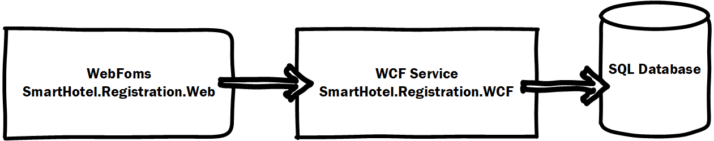
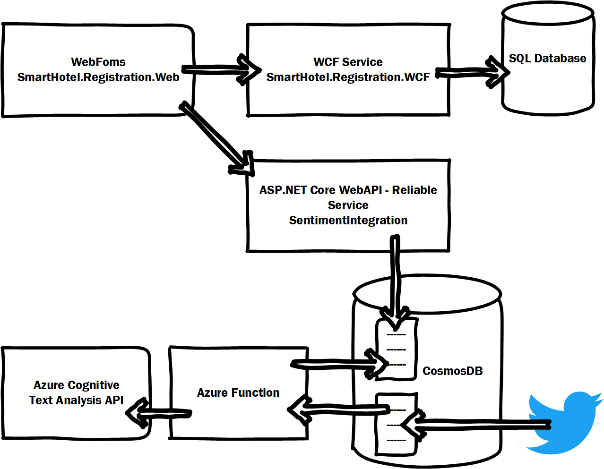

# SmartHotel - Internal Booking application

During our Microsoft **Connect(); 2017** event we presented a story on how to take an existing ASP.NET Webforms and WCF service to Azure and build out the application with new cloud-native services.

We are happy to announce the release of the SmartHotel Internal Booking application repository. This repository contains all the source code for you to browse over, or walk-through the modernization steps yourself.

The steps we showed in the presentation were:

1. Deploy the existing application to VMs in Azure
2. Create docker containers for the two services and deploy them to an Azure Service Fabric cluster, and host the database in Azure SQL
3. Extend the functionality using an Azure function to do sentiment analysis of Tweets from a CosmosDB database

If you missed the presentation, you can watch <a href="https://channel9.msdn.com/events/Connect/2017/G100">Corey Sander's session: Application modernization with Microsoft Azure in Channel 9</a>. You'll also find a copy of the slides in case that interest you.

In this document, you'll find an overview of the application, the repository and a walk-through of how to lift & shift and modernization steps of the code.

## Application Overview

The application we are using in this sample is a hotel front-desk registration application. It's basic functionality is to check guest in and out.


To modernize the application, we first want to move it to Azure. First step, we will deploy it on to a set of VMs and later in to containers and host it in Azure Service Fabric.

The application is the existing WebForms, WCF and SQL Database pieces, as depicted below. This is a very traditional three-tire application, using Entity Framework to integrate with the data in the SQL database, exposing it through a WCF service, which the WebForms application then interacts with.



The final step of the modernization is add functionality to the application to see what users are tweeting about their experiences at the hotel. We will implement the new sentiment analysis feature using Azure Service Fabric reliable Services, Azure functions, CosmosDB and Azure Cognitive Services Text Analytic API.



> In this sample we paste Tweets directly in to the CosmosDB document to simulate the feature. For a real set-up you can easily configure a Logic App to pick up tweets, and even do the sentiment analysis.

## SmartHotel360 Internal Booking Apps repository overview
The **src** folder of this repository contains the following:

- Registration
    - The original application and the starting point for the tutorial.
- Registration-modernized
    - This is the final modernized application.
- Function
    - This folder contains the Function project, which is part of the final modernized solution.

Over time we will be adding more walk-throughs of the solution to this repository, to demostrate the full end-to-end migration.

In this document, you will find a walk-through of:
- Running the modernized solution locally
- Deploying and connecting to CosmosDB in Azure
- Deploying the application to an Azure Service Fabric Cluster

## Prerequisites
To complete the walk-through, you need a developer workstation, which meets the following requirements:
- Windows 10 or Windows Server 2016 - https://docs.microsoft.com/en-us/azure/service-fabric/service-fabric-get-started
    - Note - At the time of writing (Feb 2018), debugging docker container in Service Fabric is only supported if you use Windows Server 2016 as your developer machine.
- Visual Studio 2017 Community Edition - Version 15.5 - https://www.visualstudio.com/
    - You need to have the Azure and .NET workload enabled
- Git - https://git-scm.com/
- Service Fabric SDK - 3.0 or never - https://docs.microsoft.com/en-us/azure/service-fabric/service-fabric-get-started
- Docker CE (Windows 10) or Docker EE (Windows Server) - https://docs.docker.com/docker-for-windows/install/
- Service Fabric Preview Tooling for 2017 - https://blogs.msdn.microsoft.com/azureservicefabric/2018/02/06/new-preview-tooling-for-visual-studio-2017/
- An Azure subscription - https://azure.microsoft.com/en-us/free/

> Note: To enable the full feature set of containers in Service Fabric on a local developer machine, you need to change a Service Fabric configuration. Open the file `C:\Program Files\Microsoft SDKs\Service Fabric\ClusterSetup\NonSecure\OneNode\ClusterManifestTemplate.json` and change the `iPAddress` of the nodes section, to the current IP of your computer.
```json
      "nodes": [
    {
      "nodeName": "_Node_0",
      "iPAddress": "10.0.0.4",
      "nodeTypeRef": "NodeType0",
      "faultDomain": "fd:/0",
      "upgradeDomain": "0"
    }
  ],
```

## Getting started
If you have not done so already, clone this repository to your dev machine: 

`git clone https://github.com/Microsoft/SmartHotel360-internal-booking-apps.git`

The following sections will take your through deploying the full solution in Azure. You will be guided through the following:

1. Run the modernized Service Fabric application locally
1. Deploy CosmosDB in Azure
1. Deploy the Service Fabric application in Azure
1. Deploy Cognitive Services API and the Azure Function in Azure

## Run the modernized solution locally
Let's start by running the modernized version of the application locally in containers hosted in Service Fabric. You will end up deploying three servces to Service Fabric:
- The SmartHotel.Registration.Web WebForms app in a container
- The SmartHotel.Registration.WCF WCF service in a containe
- The SentimentIntegration ASP.NET Core WebAPI as a Reliable Service

At this point, we have mocked-out CosmosDB and have yet to build the sentiment analysis function. 

1. Open Visual Studio 2017 as administrator, by right-clicking the Visual Studio icon
1. Open the solution `src\Registration-modernized\SmartHotel.Registration.sln`

> When opening the solution, Visual Studio will start pulling the required container images. You can stop this, by closing the cmd.exe window which opened.

> The solution is configured to build containers using Windows Server 2016 and to run as hyper-v containers, for the widest range of support. For more information see here: https://docs.microsoft.com/en-us/virtualization/windowscontainers/deploy-containers/version-compatibility

The application relies on a SQL database, which we need to provide for our local dev machine. Usually you would use localdb, but since the application will run in containers, we cannot rely on localdb. The easiest is to provide a SQL server using AzureSQL, as you can reuse this when moving the applciation to Azure. Follow these steps to setup an AzureSQL database: https://docs.microsoft.com/en-us/azure/sql-database/sql-database-get-started-portal.

> For information about running SQL in a container see here: https://github.com/Microsoft/mssql-docker/tree/master/windows/mssql-server-windows-developer

1. Open the file `ApplicationModern\ApplicationParameters\Local.1Node.xml` in the Solution Explorer
1. Type the database connection string in the `Value` attribute of the `<Parameter Name="SmartHotel.Registration.Wcf.Env.DefaultConnection"  Value="" />` element. This will pass the connection string to the database as an environment parameter to the container, when you deploy the container to your local cluster.
1. Press `F5` to start debugging the solution. At this point a few things need to happen.
    1. The base container images for your containerized applications will be downloaded. This might take a while.
    1. The Service Fabric applications will be build and a Service Fabric developer cluster will be setup on your computer.
1. Once the application is up and running, Visual Studio will open the applicaiton in a browser.
    - Visual Studio support debugging services even though they run in containers, so you should be able to step-through how the different services communicate.
    - By clicking on the Sentiment link on the front page, the WebForms service will call out to the ASP.NET Core WebAPI to get sentiment data.
1. To see the services deployed in Service Fabric, you can browse to Service Fabric Explorer http://localhost:19080

Now that you've see how the application runs in containers and interact with a reliable service locally, let's go ahead and setup CosmosDB in Azure.

## Deploy and connect to CosmosDB in Azure
In this part we will create a CosmosDB database and connect our local application to this.

> Azure CosmosDB also has a local emulator option: https://docs.microsoft.com/en-us/azure/cosmos-db/local-emulator

1. Follow the steps described here to create a CosmosDB account in Azure using the SQL API: https://docs.microsoft.com/en-us/azure/cosmos-db/tutorial-develop-sql-api-dotnet#create-an-azure-cosmos-db-account
1. Once the CosmosDB account has been set up, browse to the resource
1. In the Getting started guide, choose `Open Data Explorer`
1. In `Data Explorer` delete the existing `ToDoList` database and click `New Collecion`
1. Use the following values:
    - Database id: Tweets
    - Collection id: Tweets
    - Storage Capacity: Fixed (10 GB)
1. Click `OK`
1. Unfold the new databse and collection and choose `Documents`
1. Click `New Document` and paste the following JSON in the document window
    ```JSON
        {
                "id": "2ed5e734-8034-bf3a-ac85-705b7713d911",
                "tweetId": 927750234331580911,
                "tweetUrl": "https://twitter.com/status/927750237331580911",
                "userName": "CoreySandersWA",
                "userAlias": "@CoreySandersWA",
                "userPictureUrl": "",
                "text": "This is a tweet about #SmartHotel",
                "language": "en",
                "sentiment": 0.5,
                "retweet_count": 1,
                "followers": 500, 
                "hashtags": [
                    ""
                ]
        }
    ```
1. Click `Save`. You can add more sample data to the collection if you want to.

Now that we have a CosmosDB in Azure, let's configure our application to connect to it.

1. In `Visual Studio`, Open the file `ApplicationModern\ApplicationParameters\Local.1Node.xml` in the Solution Explorer
1. Fill in the value for the following two parameters
    ```XML
        <Parameter Name="SentimentIntegration.CosmosDBEndpoint" Value="[URI]" />
        <Parameter Name="SentimentIntegration.CosmosDBAuthKey" Value="[Key]" />
    ```
    - The CosmosDBEndpoint being the URI and the CosmosDBAuthKey being on of the Keys. You can obtain both values form the Azure Portal.
1. To rerun the application locally and see data from CosmosDB - press `F5`

When the applicaiton comes up, and you browse to the Sentiment page, you should now see the sentiment data from CosmosDB.

## Deploy the application to an Azure Service Fabric Cluster
In this part of the walk-through we will deploy the application to a cluster in Azure.

First we nedd to setup a Service Fabric cluster in Azure to run our application.
1. Follow the instructions here: https://docs.microsoft.com/en-us/azure/service-fabric/service-fabric-cluster-creation-via-portal to create a Service Fabric cluster in the Azure Portal
1. We also need an Azure Container Registry to copy our containers to. Follow these steps to create an Azure Container Registry: https://docs.microsoft.com/en-us/azure/container-registry/container-registry-get-started-portal
1. In `Visual Studio`, Open the file `ApplicationModern\ApplicationParameters\Cloud.xml` in the Solution Explorer. This file defines all the parameters we will use, when deploying the application to the cluster in Azure.
    ```XML
        <Parameter Name="SmartHotel.Registration.Wcf.Env.DefaultConnection" Value="[SQLConnectionString]" />
        <Parameter Name="SentimentIntegration.CosmosDBEndpoint" Value="[URI]" />
        <Parameter Name="SentimentIntegration.CosmosDBAuthKey" Value="[Key]" />
    ```
1. `Right-click` the `ApplicationModern` project and choose `Publish`
1. If not signed-in, sign-in to Azure and choose your newly created cluster from the drop-down menu.
1. Choose the Azure Container Registry you created
1. Choose the Cloud.xml parameter file
1. Click `Publish`

This concludes the walk-through of deploying the modernized version of the SmartHotel Registration system to Azure.

## More info
If you are looking for the other parts of the SmartHotel360 application. which was used throughout Connect(); 2017, please visit these repositories:
* [SmartHotel360](https://github.com/Microsoft/SmartHotel360)
* [Backend Services](https://github.com/Microsoft/SmartHotel360-Azure-backend)
* [Public Website](https://github.com/Microsoft/SmartHotel360-public-web)
* [Mobile Apps](https://github.com/Microsoft/SmartHotel360-mobile-desktop-apps)
* [Sentiment Analysis](https://github.com/Microsoft/SmartHotel360-Sentiment-Analysis-App)

## Contributing
This project welcomes contributions and suggestions.  Most contributions require you to agree to a
Contributor License Agreement (CLA) declaring that you have the right to, and actually do, grant us
the rights to use your contribution. For details, visit https://cla.microsoft.com.

When you submit a pull request, a CLA-bot will automatically determine whether you need to provide
a CLA and decorate the PR appropriately (e.g., label, comment). Simply follow the instructions
provided by the bot. You will only need to do this once across all repos using our CLA.

This project has adopted the [Microsoft Open Source Code of Conduct](https://opensource.microsoft.com/codeofconduct/).
For more information see the [Code of Conduct FAQ](https://opensource.microsoft.com/codeofconduct/faq/) or
contact [opencode@microsoft.com](mailto:opencode@microsoft.com) with any additional questions or comments.