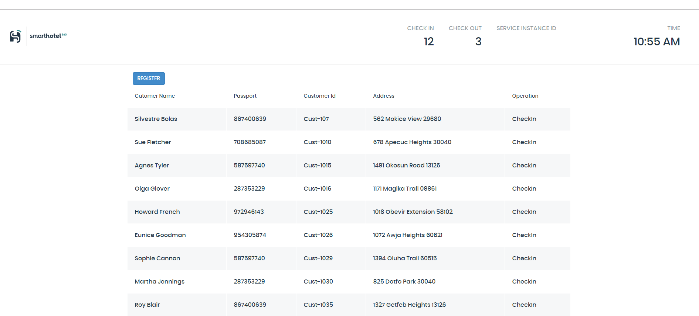
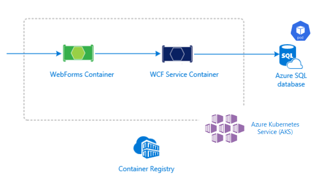
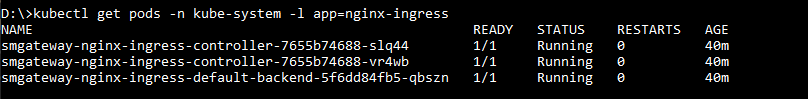
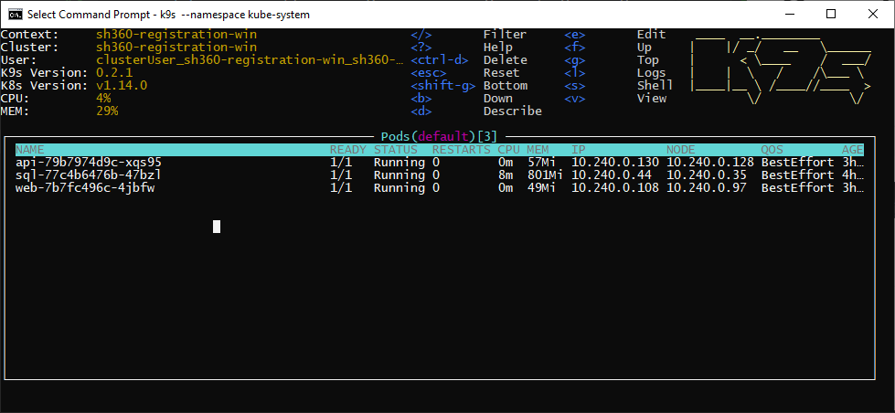
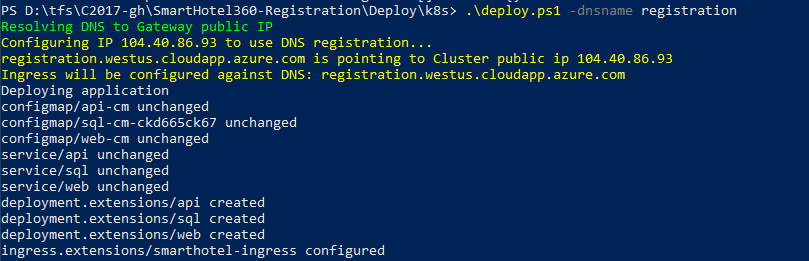

# **The project SmartHotel360 have been retired, we have archived it. It is no longer maintained. You still can fork the repository.**

## For the latest sample references visit: https://aka.ms/tailwindtraders & https://aka.ms/rpsls 

# SmartHotel360 Registration - Sample Reference Application

The front desk at [SmartHotel360](https://github.com/Microsoft/SmartHotel360) use the following application to register customers throught the check-in and check-out process. In the application we have the customer information, the operation to execute.



## Technical Information

1. As part of the solution there are two projects the Windows Communication Foundation (WCF) and an ASP.NET Web Forms, both application were built with .NET Framework 4.7
1. The WCF is connected to a SQL Server Database and the Web App consumes the WCF service.
1. You can either run the website and the WCF locally, deploy those to Azure App Service or deploy the whole solution to Azure Kubernetes Services to the version 1.14.5 (in preview) or latest which support Windows Containers.



> Note: the source code has pre-configured an existing [Azure Application Insight](https://docs.microsoft.com/en-us/azure/azure-monitor/app/app-insights-overview) to monitor the application, if you want to change or remove the `instrumentation key` just modify the 
line 140 in the **ApplicationInsights.config** files.

# Getting Started

The following guide covers the step by step of how to run the two applications locally using Docker with Windows Containers and then how to deploy the solution to an Azure Kubernetes Service cluster with Windows Containers enabled.

## Before you begin

1. You will need Visual Studio 2015 or higher on Windows 10.

1. You will Docker with Windows Containers.

1. You will need an active [Azure Subscription](https://github.com/Microsoft/SmartHotel360#sign-up-for-microsoft-azure) in order to follow this guide.

1. [Azure CLI](https://docs.microsoft.com/en-us/cli/azure/install-azure-cli?view=azure-cli-latest)

1. AKS-preview CLI extension (explained in this guide).

1. Download and install helm (explained in this guide).

## Deployment Guide

### Deploy locally on Docker Windows Container

1. Open Visual Studio as Administrator.

2. Open the **SmartHotel360.Registration** solution.

3. Open and set **Docker** with **Windows Containers**.

4. Publish the two projects: **SmartHotel360.Registration.WCF** and **SmartHotel360.Registration.Web** using Visual Studio. This publish will generate necessary files to run the project locally with docker. In this case we have published these projects in **obj\Docker\publish**.

5. In the source folder where the **docker-compose.yml** file is, open a PowerShell terminal and run **docker-compose build** and **docker-compose up** to build the images and run all the resources needed.

> Note: If it is your first time remember that docker-compose build may take some time because is creating and downloading all the images.

6. After docker-compose up finishes, the website will be  accessible at [http://localhost:9000](http://localhost:9000).

If the web app shows the list of customer registrations, it means that all services are up and running.

>Note: Remember that we can also debug both applications by running these projects with Visual Studio.

### Deploy to Azure Kubernetes Service (AKS)

1. Install aks-preview CLI extension

Install the aks-preview Azure CLI extension using the az extension add command, as shown in the following example:

```
az extension add --name aks-preview
```

> Note: If you've previously installed the aks-preview extension, install any available updates using the following command:
```
az extension update --name aks-preview
 ```

2. Register Windows Preview Feature

To create an AKS cluster that can use multiple node pools and run Windows Server containers, you will need to enable the WindowsPreview feature flags on your subscription. The WindowsPreview feature also uses multi-node pool clusters and virtual machine scale set to manage the deployment and configuration of the Kubernetes nodes. 

Register the WindowsPreview feature flag using the az feature register command as shown in the following example:

```
az feature register --name WindowsPreview --namespace Microsoft.ContainerService
```
 
> Note: Any AKS cluster you create after you've successfully registered the WindowsPreview feature flag use this preview cluster experience. To continue to create regular, fully-supported clusters, don't enable preview features on production subscriptions. Use a separate test or development Azure subscription for testing preview features.

It takes a few minutes for the status to show Registered. You can check on the registration status using the az feature list command:

```
az feature list -o table --query "[?contains(name, 'Microsoft.ContainerService/WindowsPreview')].{Name:name,State:properties.state}"
```

When ready, refresh the registration of the Microsoft.ContainerService resource provider using the az provider register command:

```
az provider register --namespace Microsoft.ContainerService
``` 

3. Create the Azure Resource Group

The following example creates a resource group named **SmartHotel360-Registration** in the **eastus** location.

```
az group create --name SmartHotel360-Registration --location eastus
```

The following example output shows the resource group created successfully:

```json
{
  "id": "/subscriptions/<guid>/resourceGroups/SmartHotel360-Registration",
  "location": "eastus",
  "managedBy": null,
  "name": "SmartHotel360-Registration",
  "properties": {
    "provisioningState": "Succeeded"
  },
  "tags": null,
  "type": null
}
```

4. Create AKS cluster using the CLI

In order to run an AKS cluster that supports node pools for Windows Server containers, your cluster needs to use a network policy that uses Azure CNI (advanced) network plugin. Use the following command to create an AKS cluster:

```
$PASSWORD_WIN="P@ssw0rd1234"

az aks create --resource-group SmartHotel360-Registration --name SmartHotel360Registration --node-count 1 --enable-addons monitoring --kubernetes-version 1.14.5 --generate-ssh-keys --windows-admin-password $PASSWORD_WIN --windows-admin-username azureuser --enable-vmss --network-plugin azure
```
- The cluster is configured with one node.
- The **windows-admin-password** and **windows-admin-username** parameters set the admin credentials for any Windows Server containers created on the cluster. Provide your own secure PASSWORD_WIN. 

After a few minutes, the command completes and returns JSON-formatted information about the cluster.

5. Add a Windows Server node pool
By default, an AKS cluster is created with a node pool that can run Linux containers. Use the following command to add an additional node pool that can run Windows Server containers.

```
az aks nodepool add --resource-group SmartHotel360-Registration --cluster-name SmartHotel360Registration --os-type Windows --name npwin --node-count 1 --kubernetes-version 1.14.5
```

The above command creates a new node pool named npwin and adds it to the myAKSCluster. When creating a node pool to run Windows Server containers, the default value for node-vm-size is Standard_D2s_v3. If you choose to set the node-vm-size parameter, please check the list of restricted VM sizes. The minimum recommended size is Standard_D2s_v3. The above command also uses the default subnet in the default vnet created when running az aks create.

6. Connect to the cluster
To manage a Kubernetes cluster, you use **kubectl**, the Kubernetes command-line client. If you use Azure Cloud Shell, kubectl is already installed. To install kubectl locally, use the az aks install-cli command:

```
az aks install-cli
```

> Note: Please ensure that the kubectl version is **at least** 1.14 If a previous version is installed update the Azure CLI or [install kubectl manually](https://kubernetes.io/docs/tasks/tools/install-kubectl/).

To configure kubectl to connect to your Kubernetes cluster, use the az aks get-credentials command. This command downloads credentials and configures the Kubernetes CLI to use them.

```
az aks get-credentials --resource-group SmartHotel360-Registration --name SmartHotel360Registration
```

To verify the connection to your cluster, use the following command to return a list of the cluster nodes. Nodes of the two nodepools should be listed:

```
kubectl get nodes -o wide
```


7. Download and install helm

Helm is used only to install the Nginx ingress controller. SmartHotel360 registration itself is installed using [Kustomize](https://kustomize.io/).

Please refer to [Helm installation page](https://github.com/helm/helm#install) to get the instructions on how get Helm for your system.

After you  install helm, go to the folder **Deploy\Kubernetes** and type this commands:

```
kubectl apply -f tiller-rbac.yaml
helm init --node-selectors "beta.kubernetes.io/os=linux" --service-account tiller
```

This installs helm on the cluster, in the linux nodes (helm pods are linux pods, you have to install this tooling in the linux nodes).

> Note: If you face an issue with the initialization of tiller you can specify a version of the image following this command:

```
helm init --node-selectors "beta.kubernetes.io/os=linux" --service-account=tiller --tiller-image=gcr.io/kubernetes-helm/tiller:v2.14.3
```

You can check if helm is working by running the following command:
```
helm ls
```

Now it's time to setup the ingress controller. This controller has the responsability of route the traffic to the appropiate pod, you can setup this doing:

```
helm install stable/nginx-ingress --name smgateway --namespace kube-system --set controller.replicaCount=2 --set controller.nodeSelector."beta\.kubernetes\.io/os"=linux  --set defaultBackend.nodeSelector."beta\.kubernetes\.io/os"=linux
```

To ensure the Nginx ingress controller is running you can type the following command and check the nginx ingress controller pods are running:

```
kubectl get pods -n kube-system -l app=nginx-ingress
```



8. Deploy the Application

> Note: by default for the deployment we use our public images available on [Docker Hub](https://hub.docker.com/u/smarthotel360), if you would like to change this, you just need to replace the value of the images for web and wcf services inside the **kustomize** folder.

We can install the application executing the powershell script **deploy.ps1**. When installing the app it is recommended to pass the `dnsname` parameter. 

 * `dnsname`: The DNS name to use to access your application. If the DNS contains any dot character it is considered a fully-qualified domain name (FQDN). If `dnsname` do not contain any dot is considered a subdomain name. For example: registration.smarthotel360.com

> Note: If `dnsname` is set to a FQDN you can enable SSL on the cluster. 

Optionally if you want to enable SSL for HTTPS you will need to provide the following parameters. You can use a tool like [**Let’s Encrypt**](https://letsencrypt.org) to create the certificate and the key.

* `tlsCertFile`: Name of the certificate file (PEM) that contains the TLS certificate. If not passed SSL is not enabled
* `tlsKeyFile`: Name of the private key file of the certificate. Must be unencrypted (with no password).
* `tlsSecretName`: Kubernetes secret name where TLS certificate will be stored. Defaults to `smarthotel360registration-tls`.

**Important**: If the parameter `dnsname` is a subdomain the script will auto-configure the public ip of the ingress controller to ensure it has the subdomain applied. But if the parameter `dnsname` is a FQDN the script assumes that the public IP is already configured. (You will need to setup the DNS record).

Once script is finished, the SmartHotel registration is installed. The command
```
kubectl get pods
```
 should list the three pods:



9. Accessing the Application

The ingress is configured to the domain you passed in the `dnsname` parameter of the `deploy.ps1` script. If `dnsname` where a domain, the full domain is `$dnsname.<region>.cloudapp.azure.com`. The full DNS is output by the `deploy.ps1` script:



Another way to find the domain configured is by executing the following command:

```
kubectl get ing
```

This will show the ingress resource alongside its full domain name:


If you navigate to this URL the registration website should show up.


If you face any issue feel free to [report it](https://github.com/microsoft/SmartHotel360-Registration/issues). 

# Feedback
[Help us improving this reference application by providing us your valuable opinion](https://forms.office.com/Pages/ResponsePage.aspx?id=v4j5cvGGr0GRqy180BHbR3KT2CyhiH1CpWtxmbmS23pUNVZKUDlPTVBJUU5aOUE5SFdMUkpNS1RGVCQlQCN0PWcu).

# Contributing
This project welcomes contributions and suggestions. Most contributions require you to agree to a Contributor License Agreement (CLA) declaring that you have the right to, and actually do, grant us the rights to use your contribution. For details, visit https://cla.microsoft.com.

When you submit a pull request, a CLA-bot will automatically determine whether you need to provide a CLA and decorate the PR appropriately (e.g., label, comment). Simply follow the instructions provided by the bot. You will only need to do this once across all repos using our CLA.

This project has adopted the Microsoft Open Source Code of Conduct. For more information see the Code of Conduct FAQ or contact opencode@microsoft.com with any additional questions or comments.
